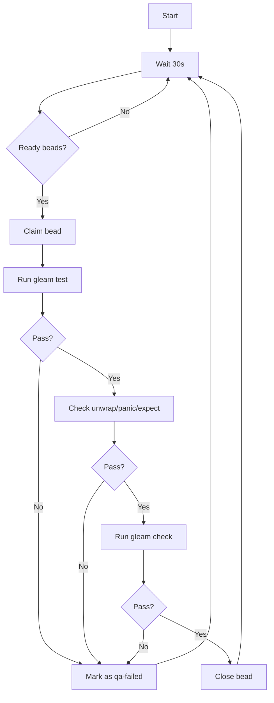

# Gatekeeper Agent

Continuous QA agent that monitors beads marked as ready for gatekeeper review and runs automated quality checks.

## Overview

The Gatekeeper Agent automates the quality assurance process for beads in the Intent CLI project. It continuously monitors for beads labeled `stage:ready-gatekeeper` and runs a comprehensive QA checklist before allowing them to proceed.

## QA Checklist

The agent runs the following checks on each bead:

1. **gleam test** - All unit tests must pass
2. **unwrap/panic/expect check** - No dangerous panic-prone patterns in source code
3. **gleam check** - Type safety validation must pass

### Check Details

#### 1. gleam test
Runs the complete test suite:
```bash
gleam test
```
- Must exit with code 0
- All tests must pass
- No compilation errors

#### 2. unwrap/panic/expect check
Scans source code for dangerous patterns:
```bash
grep -rn '\bunwrap()\|\bpanic(\|\bexpect(' src/
```
**Forbidden patterns:**
- `unwrap()` - Standalone unwrap calls (not `result.unwrap()`)
- `panic(` - Any panic function calls
- `expect(` - Any expect function calls

**Allowed patterns:**
- `result.unwrap()` - Standard library unwrap with proper error handling
- Variable names containing "unwrap", "panic", or "expect"
- Comments or documentation mentioning these terms

#### 3. gleam check
Validates type safety and compilation:
```bash
gleam check
```
- Must exit with code 0
- No type errors
- No compilation errors or warnings that break the build

## Usage

### Quick Check (Single Run)

Check if any beads are ready for gatekeeper review:

```bash
./gatekeeper_once.sh
```

This will:
- List any beads labeled `stage:ready-gatekeeper`
- Provide instructions for marking beads as ready
- Exit (no continuous monitoring)

### Continuous Monitoring

Run the gatekeeper agent in continuous mode:

```bash
./gatekeeper_agent.sh
```

The agent will:
1. Check for ready beads every 30 seconds
2. Process each bead through the QA checklist
3. Close beads that pass all checks
4. Mark beads that fail with `qa-failed` label
5. Run forever until stopped with Ctrl+C

### Background Mode

Run the agent in the background:

```bash
nohup ./gatekeeper_agent.sh > gatekeeper_output.log 2>&1 &
```

Check the log:
```bash
tail -f gatekeeper_agent.log
```

Stop the background agent:
```bash
pkill -f gatekeeper_agent.sh
```

## Workflow

### For Developers

1. **Complete your work** on a bead
2. **Run QA checks locally** (optional but recommended):
   ```bash
   gleam test
   gleam check
   grep -rn '\bunwrap()\|\bpanic(\|\bexpect(' src/ || echo "No dangerous patterns"
   ```
3. **Mark bead as ready** for gatekeeper:
   ```bash
   br update <bead-id> --label 'stage:ready-gatekeeper'
   ```
4. **Wait for gatekeeper** to process your bead
5. **Check results**:
   - If QA passes: Bead is automatically closed
   - If QA fails: Bead is marked with `qa-failed` label

### For Gatekeeper Agent

The automated workflow:



## Output

### Success Output

When a bead passes all checks:
```
✓ Closed: bd-30lt.42 - Fix syntax error in parser
```

The bead is closed with reason:
```
QA checks passed: gleam test ✓, no unwrap/panic/expect ✓, gleam check ✓
```

### Failure Output

When a bead fails checks:
```
✗ QA FAILED: bd-30lt.42 - Fix syntax error in parser
```

The bead is:
- Reverted to `open` status
- Labeled with `qa-failed`
- Annotated with failure details

## Log Files

The agent maintains a detailed log:

```
gatekeeper_agent.log
```

Log entries include:
- Timestamp for each action
- QA check results (pass/fail)
- bead IDs and titles
- Failure details with full output
- Agent lifecycle events (start/stop)

Example log entry:
```
2026-02-08 06:51:29 [INFO] === Iteration 1 ===
2026-02-08 06:51:30 [INFO] Found 1 bead(s) ready for gatekeeper review
2026-02-08 06:51:30 [INFO] Processing bead: bd-30lt.42 - Fix syntax error
2026-02-08 06:51:30 [INFO] Claiming bead bd-30lt.42...
2026-02-08 06:51:31 [INFO] === Starting QA Checks ===
2026-02-08 06:51:31 [INFO] Running gleam test...
2026-02-08 06:51:35 [INFO] gleam test: FAILED
2026-02-08 06:51:35 [ERROR] === QA Checks FAILED ===
2026-02-08 06:51:35 [ERROR] Marking bead bd-30lt.42 as failed: QA checks failed
```

## Integration with br (beads_rust)

The gatekeeper agent integrates seamlessly with the br workflow:

### Labels Used

- `stage:ready-gatekeeper` - Marks beads ready for QA review
- `qa-failed` - Marks beads that failed QA checks

### Status Transitions

```
open (with stage:ready-gatekeeper label)
  ↓
in_progress (claimed by gatekeeper)
  ↓
closed (if QA passes)
  ↓
open (if QA fails, with qa-failed label)
```

### Commands Used

```bash
# Find ready work
br ready --label "stage:ready-gatekeeper" --json

# Claim bead
br update <bead-id> --status in_progress --json

# Close bead (QA passed)
br close <bead-id> --reason "QA checks passed..." --json

# Mark as failed (QA failed)
br update <bead-id> --status open --label "qa-failed" --notes "..." --json
```

## Configuration

Edit the configuration variables in `gatekeeper_agent.sh`:

```bash
CHECK_INTERVAL=30  # seconds between checks
LOG_FILE="gatekeeper_agent.log"
PROJECT_ROOT="/home/lewis/src/intent-cli"
```

## Troubleshooting

### Agent won't start

1. Check that `gleam` is installed:
   ```bash
   which gleam
   gleam --version
   ```

2. Check that `jq` is installed:
   ```bash
   which jq
   ```

3. Check file permissions:
   ```bash
   chmod +x gatekeeper_agent.sh
   ```

### Beads not being processed

1. Verify bead has the correct label:
   ```bash
   br list --label "stage:ready-gatekeeper"
   ```

2. Check the agent log for errors:
   ```bash
   tail -50 gatekeeper_agent.log
   ```

3. Verify br is working:
   ```bash
   br ready --label "stage:ready-gatekeeper" --json
   ```

### False positives in unwrap check

If the check flags legitimate code:

1. Review the flagged code pattern
2. Consider using `result.unwrap()` instead of standalone `unwrap()`
3. Or use proper pattern matching instead of unwrap

## Best Practices

### For Developers

1. **Run QA checks before marking beads ready**
   - Saves time by catching issues early
   - Prevents unnecessary qa-failed labels

2. **Fix QA failures promptly**
   - Check the log file for detailed error output
   - Fix all issues before re-marking as ready
   - Remove the `qa-failed` label when re-submitting

3. **Use proper error handling**
   - Avoid `unwrap()`, `panic()`, `expect()`
   - Use pattern matching and Result types
   - Follow Gleam best practices

### For Maintainers

1. **Monitor gatekeeper agent health**
   - Check the log file regularly
   - Ensure agent is running (use background mode with monitoring)
   - Review qa-failed beads weekly

2. **Update QA checklist as needed**
   - Add new checks to the agent script
   - Document changes in this README
   - Communicate changes to the team

3. **Tune check interval**
   - Default: 30 seconds
   - Increase for large projects (60-120 seconds)
   - Decrease for rapid iteration (15-20 seconds)

## Example Session

```bash
# Terminal 1: Start gatekeeper agent
./gatekeeper_agent.sh
# Output: Gatekeeper agent running (PID: 12345)

# Terminal 2: Mark a bead as ready
br update bd-30lt.42 --label 'stage:ready-gatekeeper'

# Back in Terminal 1 (agent output):
# Found 1 bead(s) ready for gatekeeper review
# Processing bead: bd-30lt.42 - Fix syntax error in parser
# === Starting QA Checks ===
# gleam test: FAILED
# === QA Checks FAILED ===
# ✗ QA FAILED: bd-30lt.42 - Fix syntax error in parser

# Terminal 2: Fix the issue and re-submit
# ... fix the code ...
br update bd-30lt.42 --label 'stage:ready-gatekeeper'

# Terminal 1 (agent output):
# Found 1 bead(s) ready for gatekeeper review
# Processing bead: bd-30lt.42 - Fix syntax error in parser
# === Starting QA Checks ===
# gleam test: PASSED
# No dangerous unwrap/panic/expect found: PASSED
# gleam check: PASSED
# === All QA Checks PASSED ===
# ✓ Closed: bd-30lt.42 - Fix syntax error in parser
```

## See Also

- [AGENTS.md](AGENTS.md) - General agent workflow and br usage
- [CLAUDE.md](CLAUDE.md) - Project-specific instructions
- [beads_rust documentation](https://github.com/steveyegge/beads) - Issue tracking system
