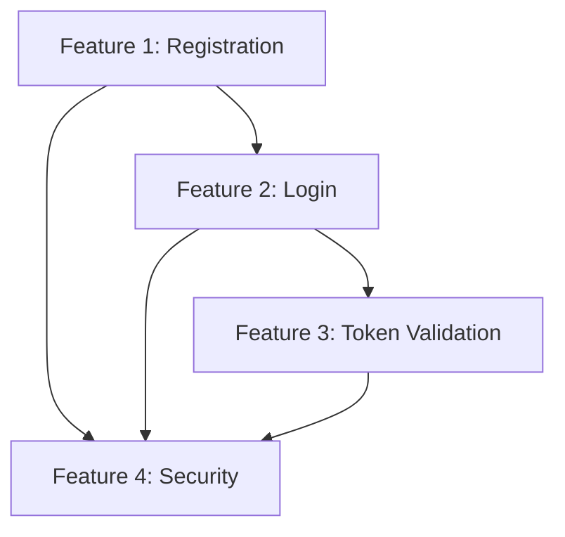

# Intent CLI - Review & Edit Workflow

**Critical Principle**: Nothing gets to beads until it's reviewed and approved.

---

## The Checkpoint System

```
Interview → ✋ REVIEW → Analyze → ✋ REVIEW → Contract → ✋ REVIEW → Structure → ✋ REVIEW → Generate Beads
```

At each checkpoint:
- Review what was generated
- Edit if needed
- Approve to continue OR regenerate

---

## Review Commands

### Review Requirements (After Interview)

```
/intent:review-requirements
```

**Shows:**
```markdown
━━━━━━━━━━━━━━━━━━━━━━━━━━━━━━━━━━━━━━━━━━━
  REQUIREMENTS REVIEW
━━━━━━━━━━━━━━━━━━━━━━━━━━━━━━━━━━━━━━━━━━━

Total Requirements: 24

EARS Pattern Breakdown:
✓ Ubiquitous: 6 requirements
✓ Event-Driven: 10 requirements
✓ State-Driven: 4 requirements
✓ Optional: 2 requirements
✓ Unwanted: 2 requirements
⚠ Complex: 0 requirements (expected 1-3)

Sample Requirements:

[Ubiquitous]
1. THE SYSTEM SHALL validate all inputs against schema
2. THE SYSTEM SHALL log all requests with timestamps
3. THE SYSTEM SHALL use HTTPS for all communications

[Event-Driven]
1. WHEN user submits registration THE SYSTEM SHALL validate email format
2. WHEN login succeeds THE SYSTEM SHALL return JWT with 24-hour expiry
3. WHEN password reset requested THE SYSTEM SHALL send email within 30 seconds

[State-Driven]
1. WHILE user is authenticated THE SYSTEM SHALL allow access to dashboard
2. WHILE session is active THE SYSTEM SHALL refresh token before expiry

[Optional]
1. WHERE beta feature flag enabled THE SYSTEM SHALL show new dashboard
2. WHERE admin role THE SYSTEM SHALL allow user management

[Unwanted]
1. IF authentication fails THE SYSTEM SHALL NOT grant access
2. IF rate limit exceeded THE SYSTEM SHALL NOT accept requests

━━━━━━━━━━━━━━━━━━━━━━━━━━━━━━━━━━━━━━━━━━━

Quality Checks:
✓ All requirements use EARS patterns
✓ No ambiguous language ("should", "may", "could")
✓ All triggers/states/conditions are specific
⚠ Missing complex requirements (WHILE X WHEN Y)
⚠ No performance requirements (response time, throughput)

━━━━━━━━━━━━━━━━━━━━━━━━━━━━━━━━━━━━━━━━━━━

Actions:
1. /intent:edit-requirements     # Edit .intent/REQUIREMENTS.md
2. /intent:add-requirement       # Add single requirement interactively
3. /intent:remove-requirement    # Remove specific requirement
4. /intent:approve-requirements  # Continue to analysis
5. /intent:redo-interview        # Start over
```

---

### Review Analysis (After Mental Lattices)

```
/intent:review-analysis
```

**Shows:**
```markdown
━━━━━━━━━━━━━━━━━━━━━━━━━━━━━━━━━━━━━━━━━━━
  MENTAL LATTICE ANALYSIS REVIEW
━━━━━━━━━━━━━━━━━━━━━━━━━━━━━━━━━━━━━━━━━━━

Original Requirements: 24
Discovered Requirements: 41
Total: 65

Lattice 1: Inversion (What Could Fail?)
━━━━━━━━━━━━━━━━━━━━━━━━━━━━━━━━━━━━━━━━━━━

Security Inversions (12 discovered):
✓ SQL injection in email field
✓ XSS in user-generated content
✓ Auth bypass via expired tokens
✓ Rate limit bypass via distributed requests
✓ CSRF on state-changing operations
✓ Privilege escalation via role manipulation
... 6 more

Usability Inversions (8 discovered):
✓ Email not found → 404 with clear message
✓ Invalid email format → 400 with examples
✓ Duplicate email → 409 with suggestion
... 5 more

Integration Inversions (6 discovered):
✓ Idempotent user creation (duplicate POST)
✓ Token refresh race condition
... 4 more

━━━━━━━━━━━━━━━━━━━━━━━━━━━━━━━━━━━━━━━━━━━

Lattice 2: Second-Order (Consequences)
━━━━━━━━━━━━━━━━━━━━━━━━━━━━━━━━━━━━━━━━━━━

DELETE user → cascading effects (5 discovered):
✓ Invalidate all user sessions
✓ Transfer ownership of created items
✓ Update audit logs (soft delete reference)
✓ Cancel pending payments
✓ Remove from email subscriptions

UPDATE user email → cascading effects (3 discovered):
✓ Verify new email before change
✓ Invalidate tokens (email in JWT claims)
✓ Update all references (case-insensitive)

━━━━━━━━━━━━━━━━━━━━━━━━━━━━━━━━━━━━━━━━━━━

Lattice 3: Pre-Mortem (Why Did This Fail?)
━━━━━━━━━━━━━━━━━━━━━━━━━━━━━━━━━━━━━━━━━━━

High Probability, High Impact (4 scenarios):
⚠ Scenario: "Users can't log in after deploy"
  Cause: JWT secret changed, invalidating all tokens
  Mitigation: Token versioning, graceful secret rotation

⚠ Scenario: "Registration spam overwhelming database"
  Cause: No rate limiting, no CAPTCHA
  Mitigation: Rate limiting + email verification

... 2 more

━━━━━━━━━━━━━━━━━━━━━━━━━━━━━━━━━━━━━━━━━━━

Lattice 4: Checklist (What Did We Miss?)
━━━━━━━━━━━━━━━━━━━━━━━━━━━━━━━━━━━━━━━━━━━

✓ Authentication covered
✓ Authorization covered
✓ Input validation covered
⚠ Missing: Password reset flow
⚠ Missing: Email verification
⚠ Missing: Account lockout after failed attempts
⚠ Missing: 2FA support

━━━━━━━━━━━━━━━━━━━━━━━━━━━━━━━━━━━━━━━━━━━

Lattice 5: Circle of Competence (What's In Scope?)
━━━━━━━━━━━━━━━━━━━━━━━━━━━━━━━━━━━━━━━━━━━

In Scope:
✓ Email/password authentication
✓ JWT token management
✓ Basic security (rate limiting, validation)

Out of Scope:
✓ OAuth providers (Google, GitHub)
✓ Biometric authentication
✓ SSO integration

Boundary Cases (Needs Clarification):
⚠ Session management (in-memory vs database?)
⚠ Token refresh strategy (sliding vs absolute?)
⚠ Password requirements (complexity rules?)

━━━━━━━━━━━━━━━━━━━━━━━━━━━━━━━━━━━━━━━━━━━

Actions:
1. /intent:edit-analysis         # Edit .intent/ANALYSIS.md
2. /intent:accept-discoveries    # Add all to REQUIREMENTS.md
3. /intent:reject-discoveries    # Review one-by-one
4. /intent:clarify-boundaries    # Answer scope questions
5. /intent:approve-analysis      # Continue to contracts
6. /intent:redo-analysis         # Run lattices again
```

---

### Review Contracts (After KIRK Generation)

```
/intent:review-contracts
```

**Shows:**
```markdown
━━━━━━━━━━━━━━━━━━━━━━━━━━━━━━━━━━━━━━━━━━━
  KIRK CONTRACTS REVIEW
━━━━━━━━━━━━━━━━━━━━━━━━━━━━━━━━━━━━━━━━━━━

Total Contracts: 65
CUE Validation: ✓ PASSED

Sample Contracts:

[Contract 1: validate-registration-email]
━━━━━━━━━━━━━━━━━━━━━━━━━━━━━━━━━━━━━━━━━━━

Intent: Ensure all registered users have valid email addresses

EARS: WHEN user submits registration THE SYSTEM SHALL validate email format

Preconditions:
✓ Request includes email field (required)
✓ Email is non-empty string
✓ Email length ≤ 320 characters

Postconditions:
✓ Valid email → accept, continue to user creation
✓ Invalid email → return 400 with error message
✓ Error message includes valid format examples

Invariants:
✓ Emails are unique (case-insensitive)
✓ All stored emails pass RFC 5322 validation

Test Coverage:
✓ Happy path: user@example.com → 200
✓ Edge: unicode email → handled
✓ Edge: SQL injection → rejected
✓ Edge: multiple @ symbols → rejected
✓ Edge: empty string → rejected

━━━━━━━━━━━━━━━━━━━━━━━━━━━━━━━━━━━━━━━━━━━

Quality Checks Per Contract:
━━━━━━━━━━━━━━━━━━━━━━━━━━━━━━━━━━━━━━━━━━━

✓ All contracts have preconditions (65/65)
✓ All contracts have postconditions (65/65)
✓ All contracts have invariants (63/65)
⚠ Missing invariants:
  - hash-password (no invariants defined)
  - generate-jwt (no invariants defined)

✓ All contracts have test coverage (65/65)
✓ Average tests per contract: 4.2
✓ Edge case coverage: 87% (193/221 edge cases have tests)

━━━━━━━━━━━━━━━━━━━━━━━━━━━━━━━━━━━━━━━━━━━

Consistency Checks:
━━━━━━━━━━━━━━━━━━━━━━━━━━━━━━━━━━━━━━━━━━━

✓ No contradicting postconditions
✓ All preconditions are testable
⚠ Potential inconsistency:
  - Contract "validate-credentials" expects hashed password in DB
  - Contract "create-user-record" doesn't specify hashing
  → Recommend: Add hashing to create-user precondition

━━━━━━━━━━━━━━━━━━━━━━━━━━━━━━━━━━━━━━━━━━━

Actions:
1. /intent:edit-contract <name>    # Edit specific contract
2. /intent:add-invariants          # Add missing invariants
3. /intent:fix-inconsistencies     # Resolve contradictions
4. /intent:show-contract <name>    # View full contract
5. /intent:approve-contracts       # Continue to structure
6. /intent:regenerate-contracts    # Regenerate from requirements
```

---

### Review Structure (After Epic/Feature Planning)

```
/intent:review-structure
```

**Shows:**
```markdown
━━━━━━━━━━━━━━━━━━━━━━━━━━━━━━━━━━━━━━━━━━━
  EPIC & FEATURE STRUCTURE REVIEW
━━━━━━━━━━━━━━━━━━━━━━━━━━━━━━━━━━━━━━━━━━━

Epic: User Authentication System
├─ Priority: 1 (High)
├─ Total Features: 4
├─ Total Tasks: 14
└─ Estimated Time: 18.5 hours

Feature Breakdown:
━━━━━━━━━━━━━━━━━━━━━━━━━━━━━━━━━━━━━━━━━━━

Feature 1: Email/Password Registration
├─ Tasks: 3
├─ Estimated Time: 3.5 hours
├─ Wave: 1 (can start immediately)
├─ Dependencies: None
└─ Tasks:
    ├─ Validate email format (0.75h, Wave 1)
    ├─ Hash password with bcrypt (1h, Wave 1)
    └─ Create user record (1.75h, Wave 2)

Feature 2: Login Flow
├─ Tasks: 3
├─ Estimated Time: 4 hours
├─ Wave: 2 (blocked by Feature 1)
├─ Dependencies: [Feature 1]
└─ Tasks:
    ├─ Validate credentials (1.5h, Wave 3)
    ├─ Generate JWT token (1.5h, Wave 3)
    └─ Return token in response (1h, Wave 4)

Feature 3: Token Validation
├─ Tasks: 3
├─ Estimated Time: 4.5 hours
├─ Wave: 3 (blocked by Feature 2)
├─ Dependencies: [Feature 2]
└─ Tasks:
    ├─ Verify JWT signature (1.5h, Wave 5)
    ├─ Check token expiry (1h, Wave 5)
    └─ Extract user from token (2h, Wave 6)

Feature 4: Security Edge Cases
├─ Tasks: 5
├─ Estimated Time: 6.5 hours
├─ Wave: 4 (blocked by all above)
├─ Dependencies: [Feature 1, Feature 2, Feature 3]
└─ Tasks:
    ├─ Prevent SQL injection (1.5h, Wave 7)
    ├─ Rate limit login attempts (2h, Wave 7)
    ├─ Invalidate tokens on logout (1h, Wave 7)
    ├─ Handle expired tokens (1h, Wave 7)
    └─ CSRF protection (1h, Wave 7)

━━━━━━━━━━━━━━━━━━━━━━━━━━━━━━━━━━━━━━━━━━━

Dependency Graph:
━━━━━━━━━━━━━━━━━━━━━━━━━━━━━━━━━━━━━━━━━━━



Wave Analysis:
━━━━━━━━━━━━━━━━━━━━━━━━━━━━━━━━━━━━━━━━━━━

Wave 1: 2 tasks (parallel) - 1.75 hours
Wave 2: 1 task - 1.75 hours
Wave 3: 2 tasks (parallel) - 1.5 hours
Wave 4: 1 task - 1 hour
Wave 5: 2 tasks (parallel) - 1.5 hours
Wave 6: 1 task - 2 hours
Wave 7: 5 tasks (parallel) - 2 hours

Parallelization: 50% (7/14 tasks can run concurrently)
Critical Path: Wave 1 → Wave 2 → Wave 3 → Wave 4 → Wave 5 → Wave 6 → Wave 7 (11.5 hours)
Total Effort: 18.5 hours
Efficiency Gain: 38% (7 hours saved via parallelization)

━━━━━━━━━━━━━━━━━━━━━━━━━━━━━━━━━━━━━━━━━━━

Quality Checks:
━━━━━━━━━━━━━━━━━━━━━━━━━━━━━━━━━━━━━━━━━━━

✓ No circular dependencies
✓ All tasks have estimates
✓ Wave assignments consistent with dependencies
⚠ Feature 4 blocked by all features (sequential bottleneck)
  → Recommendation: Split Feature 4 into two features:
    - Security Validation (can start after Feature 1)
    - Token Security (must wait for Feature 3)

⚠ Wave 7 has 5 parallel tasks (risk of context switching)
  → Recommendation: Consider sub-waves (7.1, 7.2, 7.3)

━━━━━━━━━━━━━━━━━━━━━━━━━━━━━━━━━━━━━━━━━━━

Actions:
1. /intent:edit-structure         # Edit .intent/STRUCTURE.md
2. /intent:split-feature <name>   # Split large feature
3. /intent:merge-features         # Merge small features
4. /intent:reorder-features       # Change execution order
5. /intent:optimize-waves         # Auto-optimize parallelization
6. /intent:approve-structure      # Continue to bead generation
7. /intent:regenerate-structure   # Rebuild from contracts
```

---

## Edit Commands

### Edit Requirements

```
/intent:edit-requirements
```

**Opens .intent/REQUIREMENTS.md in editor, then:**
- Validates EARS syntax
- Checks for ambiguous language
- Ensures all patterns represented
- Re-runs quality checks

**Or add single requirement:**
```
/intent:add-requirement
```

**Interactive prompts:**
```
Pattern: [Ubiquitous / Event-Driven / State-Driven / Optional / Unwanted / Complex]
> Event-Driven

Trigger (WHEN ...):
> user submits feedback

Behavior (THE SYSTEM SHALL ...):
> store feedback in database

Generated: WHEN user submits feedback THE SYSTEM SHALL store feedback in database

Confirm? [y/n]
> y

✓ Added to .intent/REQUIREMENTS.md
```

---

### Edit Analysis

```
/intent:edit-analysis
```

**Opens .intent/ANALYSIS.md, then:**
- Re-validates discovered requirements
- Updates requirement count
- Re-runs quality scoring

**Or accept/reject discoveries:**
```
/intent:review-discoveries
```

**Interactive review:**
```
Discovered Requirement 1/41:

IF input contains SQL patterns THE SYSTEM SHALL NOT execute query

Source: Inversion analysis (SQL injection security)
Category: Unwanted (security)

Accept? [y/n/skip]
> y

✓ Added to REQUIREMENTS.md

Discovered Requirement 2/41:
...
```

---

### Edit Contracts

```
/intent:edit-contract validate-registration-email
```

**Shows current contract, prompts for changes:**
```
Contract: validate-registration-email

Current Preconditions:
1. Request includes email field (required)
2. Email is non-empty string

Add precondition? [y/n]
> y

Precondition:
> Email length ≤ 320 characters

✓ Added

Edit postconditions? [y/n]
> n

Edit invariants? [y/n]
> y

Current Invariants:
1. Emails are unique (case-insensitive)
2. All stored emails pass RFC 5322 validation

Add invariant? [y/n]
> y

Invariant:
> Email domain has valid MX record

✓ Added

Save changes? [y/n]
> y

✓ Contract updated
✓ CUE validation passed
```

---

### Edit Structure

```
/intent:edit-structure
```

**Interactive structure editor:**
```
Current Structure:

1. Epic: User Authentication System
   ├─ Feature 1: Email/Password Registration (3 tasks)
   ├─ Feature 2: Login Flow (3 tasks)
   ├─ Feature 3: Token Validation (3 tasks)
   └─ Feature 4: Security Edge Cases (5 tasks)

Actions:
[1] Split feature
[2] Merge features
[3] Reorder features
[4] Add feature
[5] Remove feature
[6] Edit feature tasks
[7] Optimize waves
[8] Done

Choice: 1

Which feature to split? [1-4]
> 4

Feature 4 has 5 tasks:
1. Prevent SQL injection
2. Rate limit login attempts
3. Invalidate tokens on logout
4. Handle expired tokens
5. CSRF protection

Tasks 1-2 can start after Feature 1 (input validation)
Tasks 3-4 need Feature 3 (token management)
Task 5 needs Feature 2 (state changes)

Recommended split:
- Feature 4a: Input Security (tasks 1-2, depends on Feature 1)
- Feature 4b: Token Security (tasks 3-4, depends on Feature 3)
- Feature 4c: State Security (task 5, depends on Feature 2)

Accept recommendation? [y/n]
> y

✓ Feature 4 split into 4a, 4b, 4c
✓ Dependencies updated
✓ Waves recalculated

New parallelization: 64% (up from 50%)
New critical path: 9.5 hours (down from 11.5 hours)
```

---

## Approval Gates

### Approve Requirements

```
/intent:approve-requirements
```

**Validation before approval:**
```
Validating requirements...

✓ All requirements use EARS patterns
✓ No ambiguous language
✓ All 6 patterns represented
✓ 24 requirements total

Quality Score: 92/100

⚠ Recommendations:
- Add 1-2 complex requirements (WHILE X WHEN Y)
- Add performance requirements (response time)

Proceed anyway? [y/n]
> y

✓ Requirements approved
→ Next: /intent:analyze
```

---

### Approve Analysis

```
/intent:approve-analysis
```

**Validation:**
```
Validating analysis...

✓ All 5 mental lattices applied
✓ 41 new requirements discovered
✓ Total: 65 requirements

Discoveries by type:
- Security: 18 (inversion)
- Consequences: 12 (second-order)
- Failures: 8 (pre-mortem)
- Gaps: 3 (checklist)

Quality Score: 95/100

Add all discoveries to REQUIREMENTS.md? [y/n]
> y

✓ Updated REQUIREMENTS.md (65 requirements)
✓ Analysis approved
→ Next: /intent:contract
```

---

### Approve Contracts

```
/intent:approve-contracts
```

**Validation:**
```
Validating contracts...

✓ 65 contracts generated
✓ CUE validation passed
✓ All contracts have preconditions
✓ All contracts have postconditions
⚠ 2 contracts missing invariants

Fix missing invariants now? [y/n]
> y

Contract: hash-password
Add invariant:
> Passwords are never logged or exposed in responses

Contract: generate-jwt
Add invariant:
> JWT secret is never exposed in logs or responses

✓ Invariants added
✓ All contracts complete

Quality Score: 98/100

✓ Contracts approved
→ Next: /intent:plan-structure
```

---

### Approve Structure

```
/intent:approve-structure
```

**Final validation:**
```
Validating epic structure...

Epic: User Authentication System
├─ Features: 4
├─ Tasks: 14
├─ Total Effort: 18.5 hours
├─ Parallelization: 50%
├─ Quality Score: 96/100

✓ No circular dependencies
✓ All features have tasks
✓ All tasks have estimates
✓ Wave assignments valid

Ready to generate beads in bd database.

Continue? [y/n]
> y

✓ Structure approved
→ Next: /intent:generate-beads
```

---

## The Complete Review Flow

```bash
# 1. Interview
/intent:interview

# ✋ CHECKPOINT 1: Review Requirements
/intent:review-requirements
# → Edit if needed: /intent:edit-requirements
# → Add missing: /intent:add-requirement
/intent:approve-requirements

# 2. Analyze
/intent:analyze

# ✋ CHECKPOINT 2: Review Analysis
/intent:review-analysis
# → Edit if needed: /intent:edit-analysis
# → Review discoveries: /intent:review-discoveries
/intent:approve-analysis

# 3. Generate Contracts
/intent:contract

# ✋ CHECKPOINT 3: Review Contracts
/intent:review-contracts
# → Edit if needed: /intent:edit-contract <name>
# → Fix issues: /intent:fix-inconsistencies
/intent:approve-contracts

# 4. Plan Structure
/intent:plan-structure

# ✋ CHECKPOINT 4: Review Structure
/intent:review-structure
# → Edit if needed: /intent:edit-structure
# → Optimize: /intent:optimize-waves
/intent:approve-structure

# 5. Generate Beads (FINAL CHECKPOINT)
/intent:review-final
```

**Final Review:**
```
━━━━━━━━━━━━━━━━━━━━━━━━━━━━━━━━━━━━━━━━━━━
  FINAL REVIEW BEFORE BEAD GENERATION
━━━━━━━━━━━━━━━━━━━━━━━━━━━━━━━━━━━━━━━━━━━

Requirements: 65 (Approved ✓)
Analysis: 41 discoveries (Approved ✓)
Contracts: 65 (Approved ✓, CUE validated ✓)
Structure: 1 epic, 4 features, 14 tasks (Approved ✓)

Quality Score: 96/100 ✓

Will generate:
- 1 epic bead (bd-001)
- 4 feature beads (bd-001.1 to bd-001.4)
- 14 task beads (bd-001.1.1 to bd-001.4.5)
- 12 dependency relationships
- 7 execution waves

Estimated total effort: 18.5 hours
Parallelization: 50% (7 hours saved)

This is the FINAL checkpoint. Once beads are generated,
you'll need to use bd commands to edit them.

Generate beads now? [y/n]
> y

Generating beads...

✓ Created bd-001 (epic)
✓ Created bd-001.1 (feature)
✓ Created bd-001.1.1 (task)
...
✓ All 19 beads created
✓ All 12 dependencies set
✓ All metadata populated

Complete! Beads ready for execution.

View with:
  bd list --json
  bv --robot-triage
```

---

## Undo/Redo Commands

### Undo Last Step

```
/intent:undo
```

**Goes back one step:**
```
Current step: Contracts approved
Undo to: Analysis complete

This will:
- Delete .intent/CONTRACTS.cue
- Restore analysis state
- Allow re-approval or edits

Confirm? [y/n]
> y

✓ Reverted to analysis step
→ Use /intent:approve-analysis to continue
```

### Restart from Scratch

```
/intent:reset
```

**Clears all state:**
```
This will delete:
- .intent/REQUIREMENTS.md
- .intent/ANALYSIS.md
- .intent/CONTRACTS.cue
- .intent/STRUCTURE.md
- .intent/SESSION.cue

Keep PROJECT.md? [y/n]
> y

Confirm reset? [y/n]
> y

✓ Session reset
✓ Kept PROJECT.md
→ Use /intent:interview to start over
```

---

## Key Principles

1. **Nothing auto-proceeds** - Every step requires approval
2. **Everything is editable** - Edit at any checkpoint
3. **CUE validates everything** - Invalid state cannot proceed
4. **Quality gates enforced** - Low scores trigger warnings
5. **Beads are final** - Once generated, use bd commands to edit

**Intent CLI is a planning tool with review gates, not an auto-pilot.**
