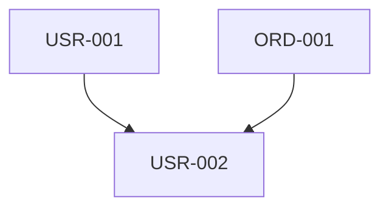

# Intent CLI → Hybrid Planning System: Transformation Plan

**Mission**: Transform Intent CLI from an API testing tool into a **world-class planning system** that combines Intent's formal rigor with GSD's context engineering patterns.

**Goal**: Output crystal-clear, atomic beads that AI can execute deterministically.

---

## Core Philosophy

```
Intent's Rigidity + GSD's Context Engineering = Perfect Planning
```

**What we KEEP from Intent:**
- ✅ EARS requirements syntax (6 patterns)
- ✅ KIRK contracts (preconditions, postconditions, invariants)
- ✅ Mental lattices (5 thinking models)
- ✅ CUE schemas for type safety
- ✅ Quality scoring (5 dimensions)
- ✅ Deterministic interview process
- ✅ Formal verification

**What we STEAL from GSD:**
- ✅ Meta-prompting architecture (commands → workflows → templates → references)
- ✅ Progressive disclosure (layered information)
- ✅ Subagent orchestration patterns
- ✅ Context engineering (size limits, fresh contexts)
- ✅ @-reference lazy loading
- ✅ State management patterns (STATE.md, PROJECT.md, ROADMAP.md)
- ✅ Parallel execution planning (wave-based)
- ✅ Anti-enterprise philosophy

**What we TRANSFORM:**
- 🔄 From "testing tool" to "planning tool"
- 🔄 From "API-only" to "any software project"
- 🔄 From "execute tests" to "generate beads"
- 🔄 From Gleam implementation to meta-prompting system
- 🔄 From single-domain to multi-domain (web, API, CLI, mobile, etc.)

---

## Architecture Overview

### New Directory Structure

```
intent-cli/
├── bin/
│   └── install.js              # NPX installer (GSD pattern)
├── commands/
│   └── intent/                 # Slash commands for Claude Code
│       ├── interview.md        # Start systematic interview
│       ├── analyze.md          # Apply mental lattices
│       ├── contract.md         # Generate KIRK contracts
│       ├── plan-phase.md       # Break into execution phases
│       ├── generate-beads.md   # Output atomic work items
│       ├── verify-plan.md      # Goal-backward verification
│       └── quality.md          # 5-dimension scoring
├── intent/                     # Meta-prompting system (GSD pattern)
│   ├── workflows/
│   │   ├── ears-interview.md          # EARS-based questioning
│   │   ├── mental-lattice-analysis.md # Apply 5 lattices
│   │   ├── kirk-contract-generation.md
│   │   ├── bead-generation.md
│   │   ├── parallel-planning.md       # Wave-based breakdown
│   │   └── quality-verification.md
│   ├── templates/
│   │   ├── project.md          # Project context (GSD pattern)
│   │   ├── requirements.md     # EARS-formatted requirements
│   │   ├── contracts.md        # KIRK contract structure
│   │   ├── roadmap.md          # Phase-based roadmap
│   │   ├── bead.cue            # Bead CUE schema
│   │   └── plan.md             # Execution plan template
│   ├── references/
│   │   ├── ears-patterns.md    # 6 EARS patterns deep-dive
│   │   ├── kirk-contracts.md   # Design by Contract
│   │   ├── mental-lattices.md  # 5 thinking models
│   │   ├── inversion.md        # Failure mode analysis
│   │   ├── second-order.md     # Consequence tracing
│   │   ├── pre-mortem.md       # Failure scenarios
│   │   └── quality-dimensions.md
│   └── agents/
│       ├── ears-interviewer.md        # Interview orchestrator
│       ├── lattice-analyzer.md        # Mental model application
│       ├── kirk-generator.md          # Contract generation
│       ├── bead-generator.md          # Atomic work item creation
│       └── quality-verifier.md        # Quality scoring
├── schema/
│   ├── bead.cue                # Bead definition schema
│   ├── contract.cue            # KIRK contract schema
│   ├── requirements.cue        # EARS requirements schema
│   ├── quality.cue             # Quality metrics schema
│   └── session.cue             # Interview session state
└── src/
    └── intent/                 # Keep Gleam code for CUE validation
        ├── validator.gleam     # CUE schema validation
        └── quality.gleam       # Quality scoring engine
```

---

## Phase 1: Meta-Prompting Foundation

### 1.1 Command Layer (Thin Orchestrators)

Create slash commands following GSD pattern:

**`commands/intent/interview.md`**
```yaml
---
name: intent:interview
description: Start systematic EARS-based requirements interview
argument-hint: "[project-name]"
allowed-tools: [Read, Write, Bash, Task, AskUserQuestion]
---

<objective>
Launch systematic interview using EARS patterns to extract complete requirements.

Output: .intent/PROJECT.md, .intent/REQUIREMENTS.md, .intent/SESSION.cue
</objective>

<execution_context>
@~/.claude/intent/workflows/ears-interview.md
@~/.claude/intent/references/ears-patterns.md
@~/.claude/intent/templates/requirements.md
</execution_context>

<context>
Project: $ARGUMENTS

@.intent/PROJECT.md (if exists)
@.intent/SESSION.cue (if exists - resume interview)
</context>

<process>
1. Check for existing project state
2. Spawn ears-interviewer agent
3. Handle interview progression
4. Validate output with CUE schemas
5. Present next steps
</process>

<success_criteria>
- [ ] PROJECT.md created with complete context
- [ ] REQUIREMENTS.md contains EARS-formatted requirements
- [ ] SESSION.cue validates against schema
- [ ] All 6 EARS patterns represented
</success_criteria>
```

**`commands/intent/analyze.md`**
```yaml
---
name: intent:analyze
description: Apply mental lattices to requirements (inversion, second-order, pre-mortem)
argument-hint: ""
allowed-tools: [Read, Write, Task]
---

<objective>
Apply 5 mental lattices to find gaps, edge cases, and failure modes.

Input: .intent/REQUIREMENTS.md
Output: .intent/ANALYSIS.md with discovered issues
</objective>

<execution_context>
@~/.claude/intent/workflows/mental-lattice-analysis.md
@~/.claude/intent/references/inversion.md
@~/.claude/intent/references/second-order.md
@~/.claude/intent/references/pre-mortem.md
</execution_context>

<process>
1. Load requirements
2. Spawn lattice-analyzer agent
3. Apply each lattice systematically
4. Generate discovered requirements
5. Score quality improvements
</process>
```

**`commands/intent/contract.md`**
```yaml
---
name: intent:contract
description: Generate KIRK contracts (preconditions, postconditions, invariants)
argument-hint: ""
allowed-tools: [Read, Write, Task]
---

<objective>
Transform EARS requirements into machine-verifiable KIRK contracts.

Input: .intent/REQUIREMENTS.md
Output: .intent/CONTRACTS.cue (validated)
</objective>
```

**`commands/intent/plan-phase.md`**
```yaml
---
name: intent:plan-phase
description: Break requirements into parallel execution phases
argument-hint: "<phase-number>"
allowed-tools: [Read, Write, Task]
---

<objective>
Apply GSD's parallel planning patterns to break work into waves.

Input: .intent/CONTRACTS.cue
Output: .intent/phases/XX-name/PLAN.md files
</objective>

<execution_context>
@~/.claude/intent/workflows/parallel-planning.md
@~/.claude/intent/references/wave-based-execution.md
@~/.claude/get-shit-done/references/goal-backward.md  # Steal from GSD
</execution_context>
```

**`commands/intent/generate-beads.md`**
```yaml
---
name: intent:generate-beads
description: Generate atomic beads from contracts and plans
argument-hint: "[phase-number]"
allowed-tools: [Read, Write, Task, Bash]
---

<objective>
Create crystal-clear, atomic work items (beads) from KIRK contracts.

Input: .intent/CONTRACTS.cue, .intent/phases/*/PLAN.md
Output: Beads created in bd database
</objective>

<execution_context>
@~/.claude/intent/workflows/bead-generation.md
@~/.claude/intent/templates/bead.cue
</execution_context>

<process>
1. Load contracts and plans
2. Spawn bead-generator agent
3. For each contract:
   - Generate bead with all fields
   - Include preconditions, postconditions, invariants
   - Enumerate edge cases from inversion analysis
   - Define acceptance criteria
   - Calculate dependencies
4. Create beads in bd database
5. Generate dependency graph
6. Output execution order
</process>
```

### 1.2 Workflow Layer (Detailed Logic)

**`intent/workflows/ears-interview.md`**
```markdown
# EARS Interview Workflow

<purpose>
Systematically extract requirements using all 6 EARS patterns.
</purpose>

<pattern_order>
1. Ubiquitous (always true)
2. Event-Driven (when X, do Y)
3. State-Driven (while X, do Y)
4. Optional (where X, do Y)
5. Unwanted (shall NOT)
6. Complex (combinations)
</pattern_order>

<pattern name="ubiquitous">
**Questions to ask:**
1. What must ALWAYS be true, regardless of context?
2. What are the non-negotiable behaviors?
3. What universal constraints exist?
4. What would break if these weren't true?

**Output format:**
THE SYSTEM SHALL [behavior]

**Examples:**
- THE SYSTEM SHALL validate all inputs
- THE SYSTEM SHALL use HTTPS for all communication
- THE SYSTEM SHALL log all operations
</pattern>

<pattern name="event_driven">
**Questions to ask:**
1. What user actions trigger responses?
2. What external events does the system react to?
3. What time-based events occur?
4. What happens when data changes?

**Output format:**
WHEN [trigger] THE SYSTEM SHALL [behavior]

**Follow-up questions for each trigger:**
- What preconditions must be true?
- What postconditions are guaranteed?
- What edge cases exist?
- What can fail and how?
</pattern>

<!-- Continue for all 6 patterns -->
</ears-interview>
```

**`intent/workflows/mental-lattice-analysis.md`**
```markdown
# Mental Lattice Analysis Workflow

<lattice name="inversion">
**Principle:** "Invert, always invert" - ask what could FAIL

For each requirement, systematically check:

<security_inversions>
- auth-bypass: Can user access without authentication?
- privilege-escalation: Can regular user perform admin actions?
- sql-injection: Are inputs sanitized?
- xss-payload: Are outputs escaped?
- rate-limit-bypass: Can user exceed limits?
</security_inversions>

<usability_inversions>
- not-found: What if resource doesn't exist?
- invalid-format: What if input is malformed?
- missing-required: What if required field is absent?
- duplicate-create: What if resource already exists?
- empty-result: What if query returns nothing?
</usability_inversions>

<integration_inversions>
- idempotency: What if same request sent twice?
- timeout: What if operation takes too long?
- version-mismatch: What if client uses old API?
- partial-failure: What if some operations succeed, some fail?
</integration_inversions>

**Output:** Generate new requirements for each discovered failure mode
</lattice>

<lattice name="second_order">
**Principle:** Trace consequences beyond immediate effects

For each state-changing operation:
1. What is the immediate effect? (first-order)
2. What else changes as a result? (second-order)
3. What are the cascade effects? (third-order)

**Example:**
DELETE user
→ First: User record deleted
→ Second: User's items orphaned, sessions invalidated, audit logs reference missing user
→ Third: Analytics lose attribution, shared resources need new owner, subscriptions canceled

**Output:** Generate requirements for handling each consequence
</lattice>

<lattice name="pre_mortem">
**Principle:** Assume the project failed, work backwards

Questions:
1. What are the most likely failure scenarios?
2. For each scenario:
   - Probability: Low/Medium/High
   - Impact: Minor/Major/Critical
   - Mitigation: What prevents this?

**Output:** Generate requirements for high-probability, high-impact scenarios
</lattice>
</mental-lattice-analysis>
```

**`intent/workflows/kirk-contract-generation.md`**
```markdown
# KIRK Contract Generation Workflow

<purpose>
Transform EARS requirements into machine-verifiable contracts.
</purpose>

<contract_structure>
For each behavior:

**Preconditions** (what must be true BEFORE):
- Authentication requirements
- Required fields and their constraints
- State prerequisites
- Resource existence

**Postconditions** (what must be true AFTER):
- State changes guaranteed
- Response guarantees
- Side effects that must occur
- What must NOT change (preservation)

**Invariants** (what must ALWAYS be true):
- Data consistency rules
- Security invariants
- Business logic constraints
- Type guarantees
</contract_structure>

<example>
Behavior: create-user

Preconditions:
- auth: admin_role required
- fields: email (valid format), password (min 8 chars)
- state: email must not exist in database

Postconditions:
- user record created in database
- password hashed (never plaintext)
- id is non-null UUID
- created_at is ISO8601 timestamp
- password field absent in response

Invariants:
- emails are unique (case-insensitive)
- all timestamps are ISO8601
- passwords never appear in responses
- user ids are immutable
</example>

<validation>
Each contract must be:
- Testable (can verify preconditions/postconditions)
- Complete (no ambiguity)
- Consistent (no contradictions)
- Minimal (no redundancy)
</validation>
</kirk-contract-generation>
```

**`intent/workflows/bead-generation.md`**
```markdown
# Bead Generation Workflow

<purpose>
Create atomic, deterministic work items from KIRK contracts.
</purpose>

<bead_structure>
```cue
#Bead: {
  id: string              // Unique identifier (e.g., "USR-001")
  title: string           // Action-oriented title
  type: string            // "feature" | "bug" | "task" | "epic"
  priority: 0..4          // 0=critical, 2=medium, 4=backlog

  // What needs to be done
  what: string            // Clear description
  why: string             // Business justification

  // Acceptance criteria
  done_when: [...string]  // Measurable completion criteria

  // From KIRK contract
  preconditions: [...string]
  postconditions: [...string]
  invariants: [...string]

  // From inversion analysis
  edge_cases: [...string]
  failure_modes: [...string]

  // From second-order thinking
  consequences: [...string]

  // Execution metadata
  dependencies: [...string]  // Other bead IDs
  wave: int                  // Parallel execution wave
  estimate_minutes: int      // Effort estimate

  // Verification
  test_cases: [...#TestCase]

  // Context
  context_files: [...string]  // Files to read before starting
  output_files: [...string]   // Files to create/modify
}

#TestCase: {
  given: string   // Precondition
  when: string    // Action
  then: string    // Expected outcome
  edge_case: bool // Is this an edge case?
}
```
</bead_structure>

<generation_rules>
1. One bead per atomic unit of work (1-3 hours max)
2. No bead depends on incomplete information
3. All edge cases enumerated from inversion analysis
4. All test cases derived from KIRK contracts
5. Dependencies explicit and minimal
6. Wave assignment based on file conflicts and dependencies
</generation_rules>

<example>
```cue
bead: {
  id: "USR-001"
  title: "Implement user creation endpoint"
  type: "feature"
  priority: 1

  what: "Create POST /users endpoint that validates input and creates user record"
  why: "Core functionality for user registration"

  done_when: [
    "Endpoint accepts valid requests and returns 201",
    "Invalid requests return 400 with clear errors",
    "Passwords are hashed before storage",
    "Duplicate emails return 409",
    "All tests pass"
  ]

  preconditions: [
    "Database schema includes users table",
    "bcrypt library available for password hashing",
    "UUID generation available"
  ]

  postconditions: [
    "User record exists in database",
    "Password is hashed (never plaintext)",
    "Response excludes password field",
    "created_at timestamp is set"
  ]

  invariants: [
    "Emails are unique (case-insensitive)",
    "Passwords never in responses",
    "All timestamps are ISO8601"
  ]

  edge_cases: [
    "Empty email string",
    "Email with unicode characters",
    "Very long password (>1000 chars)",
    "SQL injection in email field",
    "Concurrent duplicate email creation",
    "Invalid JSON body",
    "Missing Content-Type header"
  ]

  failure_modes: [
    "Database connection timeout",
    "Hash function failure",
    "UUID generation collision"
  ]

  consequences: [
    "User can now authenticate",
    "User appears in user list",
    "Audit log entry created"
  ]

  dependencies: []
  wave: 1
  estimate_minutes: 90

  test_cases: [
    {
      given: "Valid email and password"
      when: "POST /users with {email, password}"
      then: "Returns 201 with user object (no password)"
      edge_case: false
    },
    {
      given: "Duplicate email"
      when: "POST /users with existing email"
      then: "Returns 409 Conflict"
      edge_case: true
    },
    {
      given: "SQL injection payload in email"
      when: "POST /users with email: \"admin'--\""
      then: "Returns 400 Bad Request"
      edge_case: true
    }
  ]

  context_files: [
    "schema/users.sql",
    "src/api/types.ts"
  ]

  output_files: [
    "src/api/users.ts",
    "test/api/users.test.ts"
  ]
}
```
</example>
</bead-generation>
```

### 1.3 Agent Layer (Subagents)

**`intent/agents/ears-interviewer.md`**
```yaml
---
name: ears-interviewer
description: Systematic EARS-based requirements interviewer
tools: Read, Write, AskUserQuestion
---

<role>
You conduct systematic interviews using EARS patterns to extract complete requirements.
</role>

<interview_flow>
1. Load interview session state (if exists)
2. Determine current pattern and questions
3. Ask questions using AskUserQuestion
4. Parse answers into EARS format
5. Validate completeness
6. Save session state
7. Continue or complete
</interview_flow>

<pattern_progression>
Round 1: Ubiquitous (5-10 requirements expected)
Round 2: Event-Driven (10-20 requirements expected)
Round 3: State-Driven (5-15 requirements expected)
Round 4: Optional (0-5 requirements expected)
Round 5: Unwanted (5-10 requirements expected)
Round 6: Complex (0-5 requirements expected)
</pattern_progression>

<validation>
Before moving to next pattern, verify:
- At least minimum requirements gathered
- All requirements properly formatted
- No ambiguous language
- Triggers/states/conditions are specific
</validation>
</ears-interviewer>
```

**`intent/agents/bead-generator.md`**
```yaml
---
name: bead-generator
description: Generate atomic beads from KIRK contracts with full context
tools: Read, Write, Bash
---

<role>
Transform KIRK contracts into crystal-clear beads with complete test coverage and edge case enumeration.
</role>

<generation_process>
For each contract:

1. **Parse contract structure**
   - Extract preconditions, postconditions, invariants
   - Identify behavior name and intent

2. **Load analysis artifacts**
   - Read inversion analysis for failure modes
   - Read second-order analysis for consequences
   - Read pre-mortem for scenarios

3. **Generate bead fields**
   - id: Use semantic prefix (USR, ORD, PAY, etc.) + number
   - title: Action-oriented (Implement X, Fix Y, Add Z)
   - what: One-sentence description
   - why: Business justification
   - done_when: From postconditions
   - preconditions: From contract
   - postconditions: From contract
   - invariants: From contract
   - edge_cases: From inversion analysis
   - failure_modes: From inversion + pre-mortem
   - consequences: From second-order analysis

4. **Generate test cases**
   - Happy path from postconditions
   - Edge cases from inversion analysis
   - Failure scenarios from pre-mortem

5. **Calculate dependencies**
   - File conflicts → sequential
   - Data dependencies → sequential
   - Independent → parallel wave

6. **Estimate effort**
   - Simple CRUD: 30-60min
   - Business logic: 60-120min
   - Complex integration: 120-180min

7. **Validate bead**
   - All required fields present
   - CUE schema validation passes
   - No circular dependencies
   - Wave assignment is valid

8. **Create in bd database**
   ```bash
   bd create "$title" -t $type -p $priority \
     --json --description="$what" \
     --deps="$dependencies"
   ```

9. **Track created bead**
   - Store bead ID
   - Update dependency graph
   - Generate next bead
</generation_process>

<output_format>
Return structured report:

```markdown
## Beads Generated: {count}

### Wave 1 (Parallel)
- {id}: {title} ({estimate}min)
- {id}: {title} ({estimate}min)

### Wave 2 (After Wave 1)
- {id}: {title} ({estimate}min)

### Dependencies Graph


### Quality Metrics
- Total beads: {count}
- Average estimate: {avg}min
- Parallelization: {percent}% parallel
- Edge case coverage: {count} edge cases
- Test coverage: {count} test cases
```
</output_format>
</bead-generator>
```

---

## Phase 2: CUE Schema Foundation

### Bead Schema (`schema/bead.cue`)

```cue
package intent

#Bead: {
  // Identity
  id: string & =~"^[A-Z]{3}-[0-9]{3}$"
  title: string & >=1
  type: "feature" | "bug" | "task" | "epic" | "chore"
  priority: >=0 & <=4

  // Description
  what: string & >=10  // At least 10 chars
  why: string & >=10

  // Acceptance
  done_when: [...string] & len(>=1)

  // KIRK Contract
  preconditions: [...string]
  postconditions: [...string] & len(>=1)  // Must have at least one
  invariants: [...string]

  // Analysis Results
  edge_cases: [...string] & len(>=3)      // At least 3 edge cases
  failure_modes: [...string]
  consequences: [...string]

  // Execution
  dependencies: [...string]
  wave: >=1
  estimate_minutes: >=15 & <=180

  // Testing
  test_cases: [...#TestCase] & len(>=1)

  // Context
  context_files: [...string]
  output_files: [...string] & len(>=1)

  // Metadata
  created_at: string  // ISO8601
  created_by: "ears-interviewer" | "lattice-analyzer" | "manual"
}

#TestCase: {
  given: string & >=5
  when: string & >=5
  then: string & >=5
  edge_case: bool
}

// Validation rules
#Bead: {
  // Type-specific validations
  if type == "epic" {
    estimate_minutes: >=180
  }

  if type == "task" {
    estimate_minutes: <=120
  }

  // Dependency validation
  dependencies: [...string & =~"^[A-Z]{3}-[0-9]{3}$"]

  // Wave validation (wave 1 has no dependencies)
  if wave == 1 {
    dependencies: []
  }
}
```

### Contract Schema (`schema/contract.cue`)

```cue
package intent

#Contract: {
  behavior: string & =~"^[a-z]+-[a-z-]+$"  // kebab-case
  intent: string & >=10

  kirk: {
    preconditions: {
      auth?: {
        required: bool
        roles?: [...string]
        permissions?: [...string]
      }

      fields: {
        required: [...string]
        optional: [...string]

        [field_name=string]: {
          type: "string" | "number" | "boolean" | "array" | "object"
          constraints?: [...string]
          validation?: string
        }
      }

      state?: [...string]
      resources?: [...string]
    }

    postconditions: {
      state_changes: [...string] & len(>=1)
      response: {
        status: >=200 & <=599

        guarantees: {
          [field_name=string]: string
        }
      }

      side_effects?: [...string]
      preservation?: [...string]
    }

    invariants: [...string]
  }

  ears_pattern: "ubiquitous" | "event_driven" | "state_driven" |
                "optional" | "unwanted" | "complex"

  ears_formatted: string  // The EARS sentence
}
```

### Quality Schema (`schema/quality.cue`)

```cue
package intent

#QualityScore: {
  overall: >=0 & <=100

  dimensions: {
    completeness: {
      score: >=0 & <=100
      target: 100
      checks: {
        all_required_fields: bool
        all_beads_have_tests: bool
        all_edge_cases_covered: bool
      }
    }

    consistency: {
      score: >=0 & <=100
      target: 100
      checks: {
        no_circular_dependencies: bool
        no_contradicting_requirements: bool
        naming_conventions_followed: bool
      }
    }

    testability: {
      score: >=0 & <=100
      target: 100
      checks: {
        all_behaviors_have_tests: bool
        all_edge_cases_tested: bool
        test_coverage_gt_80: bool
      }
    }

    clarity: {
      score: >=0 & <=100
      target: 100
      checks: {
        all_beads_have_why: bool
        all_tests_have_given_when_then: bool
        no_ambiguous_language: bool
      }
    }

    security: {
      score: >=0 & <=100
      target: 80
      checks: {
        auth_bypass_covered: bool
        sql_injection_covered: bool
        xss_covered: bool
        rate_limiting_covered: bool
        privilege_escalation_covered: bool
      }
    }
  }

  recommendations: [...string]
  gaps: [...string]
}
```

---

## Phase 3: Installation & Setup (GSD Pattern)

### NPM Installer (`bin/install.js`)

```javascript
#!/usr/bin/env node

const fs = require('fs');
const path = require('path');
const os = require('os');

const pkg = require('../package.json');

const banner = `
   ██╗███╗   ██╗████████╗███████╗███╗   ██╗████████╗
   ██║████╗  ██║╚══██╔══╝██╔════╝████╗  ██║╚══██╔══╝
   ██║██╔██╗ ██║   ██║   █████╗  ██╔██╗ ██║   ██║
   ██║██║╚██╗██║   ██║   ██╔══╝  ██║╚██╗██║   ██║
   ██║██║ ╚████║   ██║   ███████╗██║ ╚████║   ██║
   ╚═╝╚═╝  ╚═══╝   ╚═╝   ╚══════╝╚═╝  ╚═══╝   ╚═╝

   Intent CLI ${pkg.version}
   Formal planning for deterministic AI development
`;

console.log(banner);

function install(isGlobal) {
  const src = path.join(__dirname, '..');
  const claudeDir = isGlobal
    ? path.join(os.homedir(), '.claude')
    : path.join(process.cwd(), '.claude');

  console.log(`Installing to ${claudeDir}\n`);

  // Copy commands
  const commandsSrc = path.join(src, 'commands', 'intent');
  const commandsDest = path.join(claudeDir, 'commands', 'intent');
  copyRecursive(commandsSrc, commandsDest);
  console.log('✓ Installed commands/intent');

  // Copy intent system
  const intentSrc = path.join(src, 'intent');
  const intentDest = path.join(claudeDir, 'intent');
  copyRecursive(intentSrc, intentDest);
  console.log('✓ Installed intent/');

  // Copy schema
  const schemaSrc = path.join(src, 'schema');
  const schemaDest = path.join(claudeDir, 'intent', 'schema');
  copyRecursive(schemaSrc, schemaDest);
  console.log('✓ Installed schema/');

  console.log('\nDone! Run /intent:help in Claude Code.\n');
}

// ... (copy functions like GSD)

install(true);  // Or handle args like GSD
```

---

## Phase 4: Example Workflow

### User Journey

```bash
# 1. Start interview
/intent:interview my-api

# Agent asks systematic EARS questions:
# - What must ALWAYS be true? (Ubiquitous)
# - When X happens, what should occur? (Event-Driven)
# - While in state Y, what behavior? (State-Driven)
# - etc.

# Output: .intent/PROJECT.md, .intent/REQUIREMENTS.md

# 2. Apply mental lattices
/intent:analyze

# Agent applies 5 thinking models:
# - Inversion: What could fail?
# - Second-order: What are consequences?
# - Pre-mortem: Why did this fail?
# - Checklist: What did we miss?
# - Circle of competence: What's in scope?

# Output: .intent/ANALYSIS.md with discovered gaps

# 3. Generate KIRK contracts
/intent:contract

# Agent transforms EARS → KIRK contracts
# Output: .intent/CONTRACTS.cue (validated)

# 4. Plan phases (GSD pattern)
/intent:plan-phase 1

# Agent breaks into parallel waves
# Output: .intent/phases/01-name/PLAN.md

# 5. Generate beads
/intent:generate-beads

# Agent creates atomic work items
# Output: Beads in bd database

# 6. Verify quality
/intent:quality

# Agent scores on 5 dimensions
# Output: Quality report with recommendations

# 7. Execute (outside Intent CLI)
bd ready --json
# ... execute beads with other tools
```

---

## Phase 5: Migration Path

### Step 1: Keep Gleam Core
- Preserve `src/intent/validator.gleam` for CUE validation
- Preserve `src/intent/quality.gleam` for scoring
- Delete API testing code (checker, http_client, runner)

### Step 2: Build Meta-Prompting Layer
- Create commands/, intent/, schema/ structure
- Port EARS/KIRK/mental lattice logic to workflows
- Create agent definitions

### Step 3: Integration Points
- CUE validation: Call Gleam binary from Bash
- Quality scoring: Call Gleam binary, parse JSON output
- Bead creation: Use bd CLI directly

### Step 4: Testing
- Test interview flow with example project
- Verify CUE schemas validate correctly
- Ensure bead generation creates valid bd issues
- Check quality scoring produces accurate metrics

---

## Success Criteria

This transformation is complete when:

- [ ] `/intent:interview` conducts systematic EARS interviews
- [ ] `/intent:analyze` applies all 5 mental lattices
- [ ] `/intent:contract` generates valid KIRK contracts (CUE validated)
- [ ] `/intent:plan-phase` breaks work into parallel waves
- [ ] `/intent:generate-beads` creates atomic beads in bd
- [ ] `/intent:quality` scores plans 90%+ on 5 dimensions
- [ ] All state stored in CUE schemas (validated)
- [ ] Zero Gleam code execution (except CUE validation)
- [ ] All orchestration via meta-prompting
- [ ] Beads are deterministic (same input → same beads)
- [ ] Documentation complete (README, REVERSE_PROMPT)

---

## Key Innovations

1. **EARS + GSD**: Systematic requirements gathering meets context engineering
2. **CUE State Management**: Type-safe state validated at every step
3. **Mental Lattices as Agents**: Each thinking model is a subagent
4. **Bead Generation from Contracts**: KIRK contracts → deterministic beads
5. **Quality as First-Class**: 5-dimension scoring built into workflow
6. **Parallel Planning**: Wave-based execution planning from GSD
7. **Meta-Prompting Architecture**: Pure Claude orchestration, no execution

---

## Next Steps

To implement this transformation:

1. **Phase 1**: Create command structure (1 day)
2. **Phase 2**: Port EARS interview to workflow (2 days)
3. **Phase 3**: Port mental lattices to agents (3 days)
4. **Phase 4**: Build KIRK contract generator (2 days)
5. **Phase 5**: Build bead generator (2 days)
6. **Phase 6**: Integrate quality scoring (1 day)
7. **Phase 7**: Testing & documentation (2 days)

**Total: ~2 weeks for complete transformation**

---

This is now a **world-class planning system** that combines the best of both worlds.
